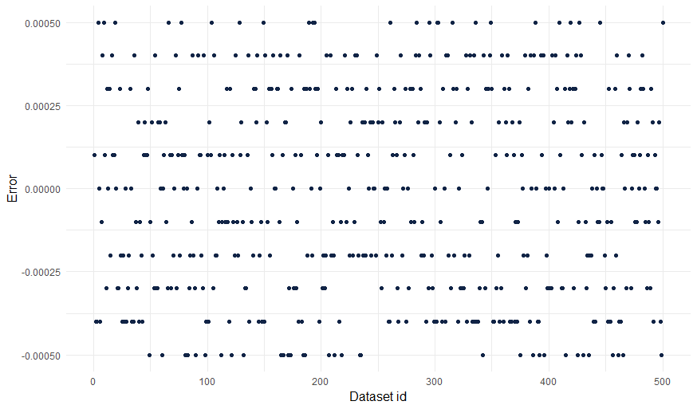

# Validate Package

## Setup

In order to run the validation code of our adaptive test, you have to have the following software installed on your computer and correctly set up:

-   Git

-   Node.js (including Node Package Manager [npm])

-   R

Enter the `validate_ML_est` directory and run the following command.
This will install the required Node packages.

```{bash eval=FALSE, include=T}
npm install
```

After that, open an R IDE of your choice and install the required R packages with `renv::restore()`.
Please ensure to set the working directory to the `validate_ML_est` folder or simply open
the `cat_simulation.Rproj` file.

## Verify Ability Estimation

To verify maximum likelihood estimation, the script `generate_data.R` will use the package `catR` (Magis and Raîche 2012) to generate 500 item banks and corresponding response patterns for an ability level of 0.
These will be saved as JSON files in the `generated` directory.

The corresponding JavaScript file `ability_estimation.test.js` in the folder `lib` will load the item banks and response patterns to run the ability estimation algorithm.
The result is then compared to `catR` (Magis and Raîche 2012) using the testing framework `Jest` (*Jestjs/Jest* 2023).
The tests will succeed if the difference between the ability estimation result and the estimation from `catR` is close to 0.

To generate the testing data and perform the tests run the following commands:

```{bash eval=F, include = T}
Rscript generate_data.R
npx jest lib/ability_estimation.test.js


```

The following plot shows the estimations errors when comparing our maximum likelihood estimation implementation with `catR`.



## Verify Item Selection

The R script `generate_item_selection.R` will start by generating 200 item banks.
It will then select the next test item given a single response in the test which is false.
The item bank and the selected item will be saved in the `generated` directory as JSON files.

In the JavaScript test `item_selection.test.js` the item bank and selected items by `catR` are read.
The program will then select a new item given the specified response pattern.
After that, the tests checks whether both selected items are the same.

To generate the testing data and perform the tests run the following commands:

```{bash eval=F, include = T}
Rscript generate_item_selection.R
npx jest lib/item_selection.test.js

```

# References

*Jestjs/Jest*.
2023.
Jest.
<https://github.com/jestjs/jest>.

Magis, David, and Gilles Raîche.
2012.
"Random Generation of Response Patterns Under Computerized Adaptive Testing with the R Package catR." *Journal of Statistical Software* 48 (8).
<https://doi.org/10.18637/jss.v048.i08>.
